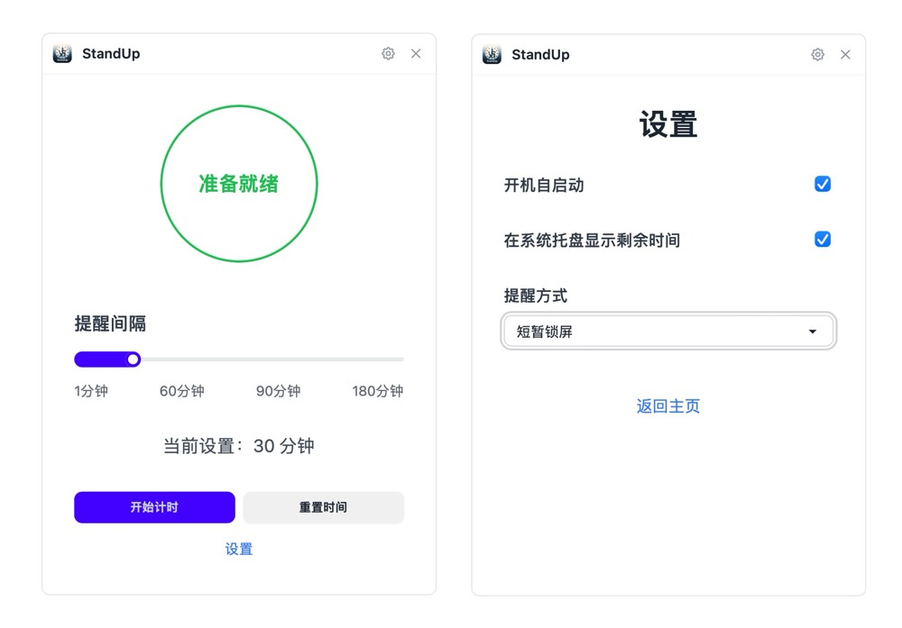

# 🧘 StandUp - 久坐提醒助手

  

StandUp 是一款简单而强大的久坐提醒应用，旨在帮助您保持健康的工作习惯，避免长时间久坐带来的健康风险。

## ✨ 主要功能

- 🕒 自定义提醒间隔：从 1 分钟到 180 分钟，灵活设置适合您的提醒时间。
- 🔔 多样化提醒方式：
  - 💻 桌面通知
  - 🔊 声音提醒
  - 🔒 短暂锁屏
- 🚀 开机自启动：确保您始终受到保护，不会忘记启动应用。
- 🖥️ 系统托盘：便捷控制，随时开始或暂停计时。
- 🎨 简洁优雅的用户界面：专注于核心功能，操作直观。

## 📸 应用预览

  

## 🚀 快速开始

1. 下载并安装 StandUp 应用。
2. 启动应用，它会自动最小化到系统托盘。
3. 点击系统托盘图标，设置您喜欢的提醒间隔和方式。
4. 开始工作，让 StandUp 照顾您的健康！

## 💡 使用技巧

- 尝试不同的提醒间隔，找到最适合您工作节奏的设置。
- 根据您的环境选择合适的提醒方式，确保不会打扰到他人。
- 利用短暂休息时间做一些简单的伸展运动，效果更佳。

## 🤝 支持与反馈

如果您在使用过程中遇到任何问题，或有任何改进建议，欢迎通过以下方式联系我们：

- 📧 Email: siyuantong7@gmail.com

## 📄 许可证

StandUp 使用 MIT 许可证。详情请查看 [LICENSE](LICENSE) 文件。

---

💪 保持健康，从 StandUp 开始！

