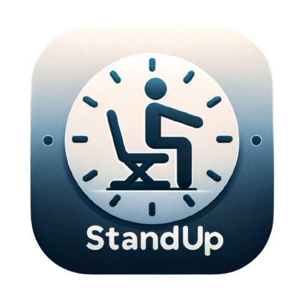

# 🧘 StandUp - Sedentary Reminder Assistant

  

[中文版](README.CN.md) | English

StandUp is a simple yet powerful sedentary reminder application designed to help you maintain healthy work habits and avoid health risks associated with prolonged sitting.[Download](https://github.com/JiuRanYa/StandUp/releases/tag/v0.3.0)

## ✨ Key Features

- 🕒 Customizable reminder intervals: Set your preferred reminder time from 1 to 180 minutes.
- 🔔 Diverse reminder methods:
  - 💻 Desktop notifications
  - 🔊 Sound alerts
  - 🔒 Brief screen lock
- 🚀 Auto-start on boot: Ensures you're always protected and never forget to start the app.
- 🖥️ System tray: Convenient control to start or pause the timer anytime.
- 🎨 Clean and elegant user interface: Focused on core functionality with intuitive operation.

## 📸 App Preview

  

## 🚀 Quick Start

1. Download and install the StandUp application.
2. Launch the app; it will automatically minimize to the system tray.
3. Click the system tray icon to set your preferred reminder interval and method.
4. Start working and let StandUp take care of your health!

## 💡 Usage Tips

- Experiment with different reminder intervals to find the setting that best suits your work rhythm.
- Choose an appropriate reminder method based on your environment to ensure you don't disturb others.
- Use the short break times to do simple stretching exercises for better results.

## 🤝 Support and Feedback

If you encounter any issues while using the app or have any suggestions for improvement, please feel free to contact us through:

- 📧 Email: siyuantong7@gmail.com
